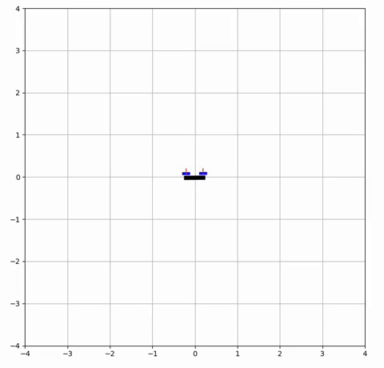

# Control-of-a-2D-Quadrotor-for-Acrobatic-Maneuvers
LQR and iLQR controllers for a 2D quadrotor.

## Simulation of 2D quadrotor

  
  
  
  

 

## Algorithim
The two algorithims for desgining the iLQR controller are given below.

  
  

 

## Graphs
The states during a full flip are vizualized below.

   

The control values are interpolated below.

 

## Report
To read a detailed report, click [HERE](assets/Report.pdf)
